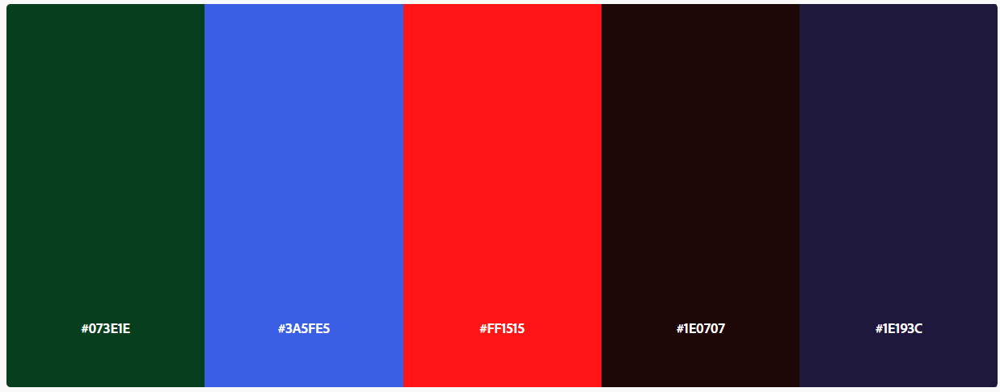
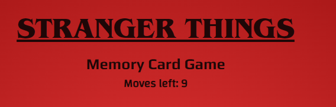
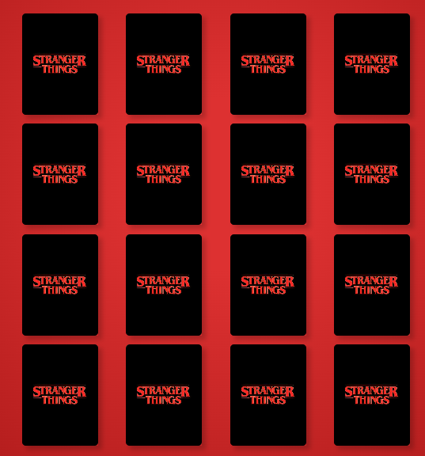

# Stranger Things Memory Card Game
Stranger Things Memory Card Game is desigend for young and old. The goal of the game is to have found all the matching cars within the provided moves available to the user. Each move includes 2 cards being clicked on to find the according match to the first card. If successfull, the player gets to pick another two card without loosing any player moves. If not successful, a moves will be substracted and the player keeps on going to find two machting cards. The game is over once all the moves have been used or all the cards were matched to each other.

## Contents

* [User Experience](#user-experience)
    * [User Stories](#user-story)
* [Design](#design)
    * [Colour Scheme](#colour-scheme)
    * [Typography](#typography)
    * [Imagery](#imagery)
    * [Wireframes](#wireframes)
* [Features](#features)
    * [General features on each page](#general-features-on-each-page)
    * [Accessibility](#accessibility)
* [Technologies Used](#technologies-used)
    * [Languages Used](#languages-used)
    * [Frameworks, Libraries & Programs Used](#frameworks-libraries-programs-used)
* [Deployment](#deployment)
* [Testing](#testing)
* [Credits](#credits)
    * [Code Used](#code-used)
    * [Content](#content)
    * [Media](#media)
    * [Acknowledgements](#acknowledgements)

## [User Experience](#user-experience)

The Stranger Things Memory Card Game is sloley for pleasure and fun, a game for young and old.

### [User Stories](#user-story)

* First-time visitors:
    * will be able to insert their username before the game starts.
    * should find out what the rules of the game are.
    * should be able to win/loose the game.
    * should be able to restart the game as many times as desired.
* Returning visitors:
    * should be able to win/loose the game.
    * should be able to restart the game as many times as desired.

## [Design](#design)

### [Colour Scheme](#colour-scheme)

[Adobe Color](https://color.adobe.com/Stranger-Things-color-theme-10253565/) was used to create a color palette for the theme Stranger Things. It uses mainly bright dark colours.

### [Typography](#typography)

I habve imported the following font from Adobe Fonts:
* ITC- Benguiat for the main heading on the page.
I have imported the follwoing fonts from Google Fonts:
* Play for h2 on the page.
* Changa for h3 on the page.

### [Imagery](#imagery) 

The imagery used for the cards are portraits of character from the Netflix series and are credited below in the section [Credits](#credits).

### [Wireframes](#wireframes)
I have used [Adobe XD](https://www.adobe.com/ie/products/xd.html) to create the wireframe for my Memory Card Game. It should have the main title at the top of the page, followed by the number of moves a user has left to find matching cards. Below this section you will find the cards, the user will flip. Between the card-section and the footer will be the result shown to the user, if they have won or lost the game.

This is my inital approach towards my project, which might change during the process of it.

## [Features](#features)

### [General features on each page](#general-features-on-each-page)

The website is a one-page page containing:
* a prompt() when loading the page for the user to input their name.
* the main heading on the top followed by the player's moves
* the game-section in the  middle of the page
* the footer at the bottom
* an alert() with a message if the game was won or lost and containing the stored username.

#### prompt()

.png) 

.answer.png)

When loading the page, user is required to insert a username to be able to play the game, which is the stored for later use. The user can also find a quick explanation what the goal of the game is. There will be a second pop up with the inserted username, wishing the player good luck with the game. 

#### Top of Page

At the top of the page to can find the title of the memory card game, which has been designed in the actual font Stranger Things are using and is placed at the top center of the page. Below you can find the player's moves count, which deductes 1 at a time if the player doesn't find to matching cards and finishes at 0, at which point the game will be over.

#### Game Section

In the middle of the page is the game-section located with all the 16 cards. The deck contains the imprint of Stranger Things and the portraits of the characters are able to be seen when the card is turned around. Each time the game is restarted the deck will be shuffled randomly, so that the player can enjoy a few rounds of the card game without knowing the postion of the cards.
Once two cards are matched with each other, they will stay face open and aren't clickable anymore. If it wasn't a match, the cards will turn back around and clickable on the next move again.

#### alert()

.win.png)

.loose.png)

At the end of each game there will be an alert() window including the user'name stating, if the game was won or lost. Once the "Ok" button was clicked, the game will restart.

#### Footer

The footer is located at the bottom of the page and contains the copyright.

### [Accessibility](#accessibility)

* For better accessibilty I added alt-labels to all my images for vision impaired users.

## [Technologies Used](#technologies-used)

### [Languages Used](#languages-used)

* HTML
* CSS
* JavaScript

### [Frameworks, Libraries & Programs Used](#frameworks-libraries-programs-used)

* [Adobe XD](https://www.adobe.com/ie/products/xd.html) to create the wireframes.
* [Git](https://git-scm.com/) for version control.
* [Gitpod](https://www.gitpod.io/) for writing down the code and creating the website.
* [Github](https://github.com/) to save and store the progress and files used on the website.
* [Google Fonts](https://fonts.google.com/) to import the fonts used on the website.
* [W3C Validator](https://validator.w3.org/) to validate HTML.
* [W3C Jigsaw Validator](https://jigsaw.w3.org/css-validator/) to validate CSS.
* [Font Awesome](https://fontawesome.com/) for the icons used on this website.
* [SheCodes](https://gradients.shecodes.io/) to add a background using linear-gradient.
* [Convertio](https://convertio.co/download/) and [CloudConvert](https://cloudconvert.com/jpg-to-webp) to convert images to .webp .
* [She Codes](https://generators.shecodes.io/css-box-shadow-generator) to generate the box-shadow for .card.
* [CSS Tricks](https://css-tricks.com/advanced-css-animation-using-cubic-bezier/) helped me to understand using the effect cubic-bezier when rotating a card.
* [MDN](https://developer.mozilla.org/en-US/docs/Web/API/Event/target) to find out more about the .target property.
* [MDN](https://developer.mozilla.org/en-US/docs/Web/API/EventTarget/addEventListener) to understand the EventTarget.addEventListener() method better.
* [Adobe Fonts](https://fonts.adobe.com/fonts/itc-benguiat#fonts-section) to download the original Stranger Things font.
* [FavIcon Generator](https://favicon.io/favicon-generator/) to generate the favicon used for my game page.

## [Deployment](#deployment)

This project was created by using Gitpod. I used the pre-built template from [Code Institute](https://github.com/Code-Institute-Org/gitpod-full-template).
The following commands were used:
* **python3 -m http.server** - to run a local server to view the project.
* **git add .** - to add all the changes.
* **git commit -m "..."** - to commit all the changes to the local repository.
* **git push** - to push the committed changes to the Github repository.

### Deployment using Github

1. Navigate to [project repository](https://github.com/sinastiller/memory-card-game).
2. Click on the Settings Tab.
3. Scroll down to pages.
4. For the source, select main branch.
5. Click save.
6. Open the link provided by Github to go to the deployed website. **[LiveLink](https://sinastiller.github.io/vegan-travel-food-blog/)**

### Cloning

1. Navigate to [project repository](https://github.com/sinastiller/memory-card-game).
2. Click on the button Code next to the Gitpod button.
3. Choose between HTTPS, SSH and Github CLI and copy the link.
4. Open Git Bash.
5. Change the current working directory to the location where you want the cloned directory.

## [Testing](#testing)

Please find the carried out testing on [TESTING.md](TESTING.md).

## [Credits](#credits)

### [Code Used](#code-used)

* [W3Schools](https://www.w3schools.com/cssref/css3_pr_transform-style.asp) was referred to, to preserve the 3D style while rotating an element; it must be always used in conjunction with the transform property.
* [W3Schools](https://www.w3schools.com/howto/howto_js_toggle_class.asp) helped me research how to toggle beetween adding and removing a class attribute to an element.
* [W3Schools](https://www.w3schools.com/js/js_arrow_function.asp) was referred to, to understand how arrow functions work.
* [DEV Community](https://dev.to/codebubb/how-to-shuffle-an-array-in-javascript-2ikj) was used to understand how to shuffle an array.
* [Css Tricks](https://css-tricks.com/how-to-stack-elements-in-css/https://css-tricks.com/how-to-stack-elements-in-css/) helped me understand how to stack the cards .frontFace and .backFace in CSS.
* [W3Schools](https://www.w3schools.com/howto/howto_css_flip_card.asp) to understand how to rotate a card.
* [W3Schools](https://www.w3schools.com/css/css3_transitions.asp) to add a transition effect when rotating a card.
* [DEV](https://dev.to/mugas/flip-cards-with-javascript-2ad0) was referred to, to understand how to flip a card/ use the toggle function in JS.
* [Stackoverflow](https://stackoverflow.com/questions/30389982/how-to-set-prompt-textbox-field-in-js-as-required-field) was used to understand , how to make the prompt() required.
* [W3School](https://www.w3schools.com/jsreF/met_win_prompt.asp) was referred to when creating the prompt().
* [Learn Vanilla Javascript: Memory Game Tutorial](https://www.youtube.com/watch?v=eMhiMsEC9Uk&list=PLLX1I3KXZ-YH-woTgiCfONMya39-Ty8qw&index=1) was referenced throughout the page.
* [Awesome Vanilla JavaScript Memory Card Game Tutorial](https://www.youtube.com/watch?v=-tlb4tv4mC4) was referenced throughout the page.

## [Content](#content)

* The page was designed by myself.
* The imagery was taken from various sources on the internet.

## [Media](#media)
* [Max](https://images6.fanpop.com/image/photos/42900000/Stranger-Things-3-Portraits-Max-Mayfield-stranger-things-42982418-800-1066.jpg)
* [Billy](https://images6.fanpop.com/image/photos/42900000/Stranger-Things-3-Portraits-Billy-Hargrove-stranger-things-42982416-300-400.jpg)
* [Lucas](https://images6.fanpop.com/image/photos/42900000/Stranger-Things-3-Portraits-Lucas-Sinclair-stranger-things-42982412-300-400.jpg)
* [Mike](https://images6.fanpop.com/image/photos/42900000/Stranger-Things-3-Portraits-Mike-Wheeler-stranger-things-42982413-300-400.jpg)
* [Dustin](https://images6.fanpop.com/image/photos/42900000/Stranger-Things-3-Portraits-Dustin-Henderson-stranger-things-42982415-300-400.jpg)
* [Will](https://images6.fanpop.com/image/photos/42900000/Stranger-Things-3-Portraits-Will-Byers-stranger-things-42982414-300-400.jpg)
* [Eleven](https://images6.fanpop.com/image/photos/42900000/Stranger-Things-3-Portraits-Eleven-stranger-things-42982419-800-1000.jpg)
* [Steve](https://media.vanityfair.com/photos/5d1cbc641c225a00086f40d3/2:3/w_665,h_998,c_limit/steve-harrington-stranger-things.jpg)
* [Card Deck Image](https://wallpapercave.com/stranger-things-logo-wallpapers)

## [Acknowledgements](#acknowledgements)

I would like to thank my mentor Jubril Akolade for his guidance, time, and patiently explanations throughout the process of the project, the awesome Slack Community for always giving the much-needed push and advice to stay motivated and eager to achieve the end result and my partner, who always told me to not give up and keep going!