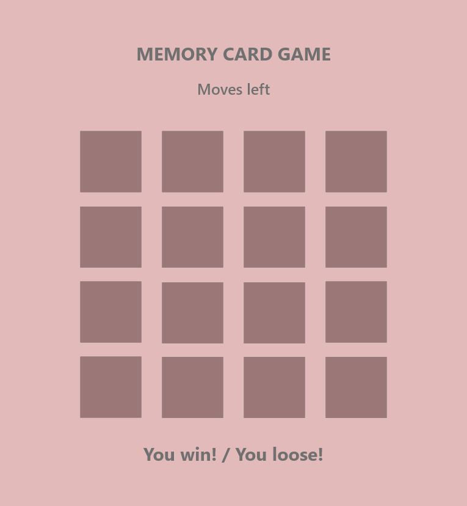

# Memory Card Game

## Contents

* [User Experience](#user-experience)
    * [User Stories](#user-story)
* [Design](#design)
    * [Colour Scheme](#colour-scheme)
    * [Typography](#typography)
    * [Imagery](#imagery)
    * [Wireframes](#wireframes)
* [Features](#features)
    * [General features on each page](#general-features-on-each-page)
    * [Accessibility](#accessibility)
* [Technologies Used](#technologies-used)
    * [Languages Used](#languages-used)
    * [Frameworks, Libraries & Programs Used](#frameworks-libraries-programs-used)
* [Deployment](#deployment)
* [Testing](#testing)
* [Credits](#credits)
    * [Code Used](#code-used)
    * [Content](#content)
    * [Media](#media)
    * [Acknowledgements](#acknowledgements)

## [Design](#design)

### [Wireframes](#wireframes)
I have used [Adobe XD](https://www.adobe.com/ie/products/xd.html) to create the wireframe for my Memory Card Game. It should have the main title at the top of the page, followed by the number of moves a user has left to find matching cards. Below this section you will find the cards, the user will flip. Between the card-section and the footer will be the result shown to the user, if they have won or lost the game.

This is my inital approach towards my project, which might change during the process of it.

## [Technologies Used](#technologies-used)

### [Frameworks, Libraries & Programs Used](#frameworks-libraries-programs-used)
* [SheCodes](https://gradients.shecodes.io/) to add a background using linear-gradient.
* [Convertio](https://convertio.co/download/) and [CloudConvert](https://cloudconvert.com/jpg-to-webp) to convert images to .webp .

## [Credits](#credits)

### [Code Used](#code-used)
* [W3Schools](https://www.w3schools.com/cssref/css3_pr_transform-style.asp) was referred to, to preserve the 3D style while rotating an element; it must be always used in conjunction with the transform property.
* [W3Schools](https://www.w3schools.com/howto/howto_js_toggle_class.asp) helped me research how to toggle beetween adding and removing a class attribute to an element.
* [W3Schools](https://www.w3schools.com/js/js_arrow_function.asp) was referred to, to understand how arrow functions work.
* [DEV Community](https://dev.to/codebubb/how-to-shuffle-an-array-in-javascript-2ikj) was used to understand how to shuffle an array.

## [Media](#media)
* [Max](https://images6.fanpop.com/image/photos/42900000/Stranger-Things-3-Portraits-Max-Mayfield-stranger-things-42982418-800-1066.jpg)
* [Billy](https://images6.fanpop.com/image/photos/42900000/Stranger-Things-3-Portraits-Billy-Hargrove-stranger-things-42982416-300-400.jpg)
* [Lucas](https://images6.fanpop.com/image/photos/42900000/Stranger-Things-3-Portraits-Lucas-Sinclair-stranger-things-42982412-300-400.jpg)
* [Mike](https://images6.fanpop.com/image/photos/42900000/Stranger-Things-3-Portraits-Mike-Wheeler-stranger-things-42982413-300-400.jpg)
* [Dustin](https://images6.fanpop.com/image/photos/42900000/Stranger-Things-3-Portraits-Dustin-Henderson-stranger-things-42982415-300-400.jpg)
* [Will](https://images6.fanpop.com/image/photos/42900000/Stranger-Things-3-Portraits-Will-Byers-stranger-things-42982414-300-400.jpg)
* [Eleven](https://images6.fanpop.com/image/photos/42900000/Stranger-Things-3-Portraits-Eleven-stranger-things-42982419-800-1000.jpg)
* [Steve](https://media.vanityfair.com/photos/5d1cbc641c225a00086f40d3/2:3/w_665,h_998,c_limit/steve-harrington-stranger-things.jpg)