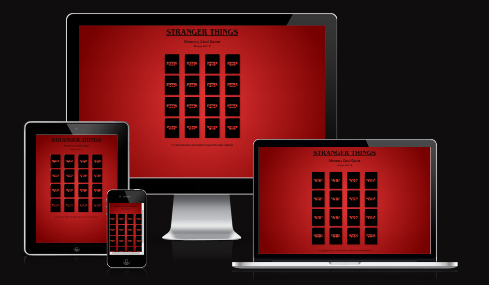
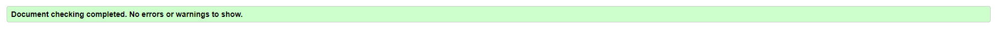
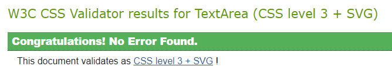
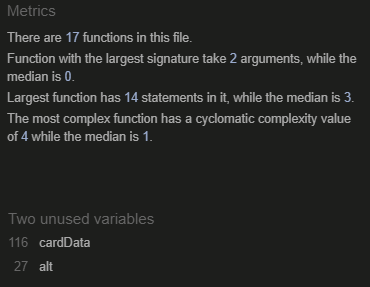
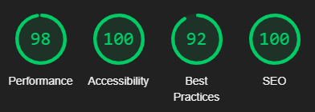

# TESTING FOR STRANGER THINGS MEMORY CARD GAME

## Contents
 * [Automated Testing](#automatedtesting)
    * [W3C Validator](#w3cvalidator)
    * [Responsiveness](#responsivness)
    * [Lighthouse](#lighthouse)
* [Manual Testing](#manualtesting)
* [Bugs](#bugs)

## [Automated Testing](#automatedtesting)

### [W3C Validator](#w3cvalidator)

* To verify that the HTML code is written in the correct structure, I tested each .html individually. There are currently no errors, as I have fixed these.

    

* To verify that the CSS code is written to the correct standards, I tested style.css using the W3C Jigsaw. There are currently no errors.

    

* [JSHint](https://jshint.com/) was used to validate script.js and returned no errors.
    

### [Responsiveness](#responsivness)

* The website was tested on different screen sizes and devices to ensure outstanding responsiveness. It has been tested on a large screen, laptop, iPad Mini, iPhone X, iPhone8, Xiaomi 9, and iPhone SE. It has also been tested in landscape mode.
* The website was tested on Mozilla Firefox, Chrome, Safari, and Microsoft Edge.

### [Lighthouse](#lighthouse)

Lighthouse was used to test the performance, accessibility, best practices, and SEO. My game page achieved a high rating in all categories.

## [Manual Testing](#manualtesting)

| FEATURE | EXPECTED OUTCOME| ACTION | RESULT |
| -------------              | -------------                                | ------------- | ------------- |
| randomizeData() | Cards being logged to console in no particular order | Open window/refresh window, inspect page, open console | Cards appear in random orders evertime page gets refreshed|
| console.log(cardData) in shufflecards()| Cards should be logged randomly to the console | Open window/refresh window, inspect page, open console | Cards appear in random orders evertime page gets refreshed|
|  console.log(flipCard) | 
| console.log(clickedCard)|
| checkForMatch(flipCard) |

## [Bugs](#bugs)

The following issues have been solved thorughout the process:
* Due to the not-working checkForMatch() I had to start over in script.js and alter some of my steps to acchieve the desired working result.
* When clicking on the cards to find two matching cards, the user was able to click on more than two in a small amount of time. To prevent this from happening I declared a variable secureBoard, that will only allow two cards to be clicked on at the same time and only when they have been flipped back, is the user able to choose the next two cards.
* I introduced the restoreCard(), so the user is able to reclick on the same card, which was selected in the last move. Also if the user clicks twice on the same card, another card still needs to be clicked on the execute the checkForMatch() and start a new flip round of choosing the next two cards.
* When game restarts, matched cards from previous round aren't clickable. For fixing this issue I re-added the .addEventListener("click", flipCard)) for all the cards, so each card is clickable again.